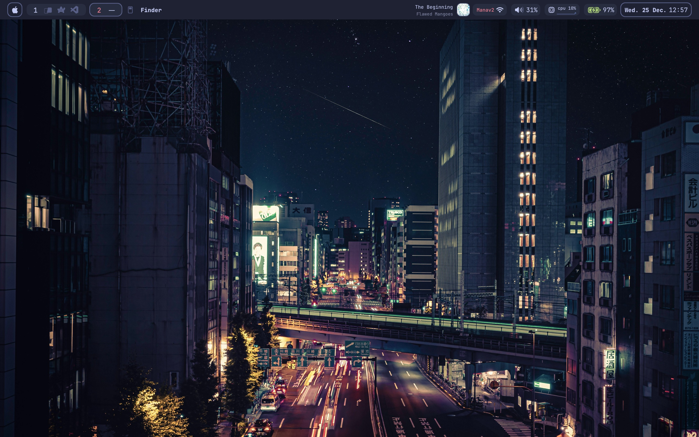
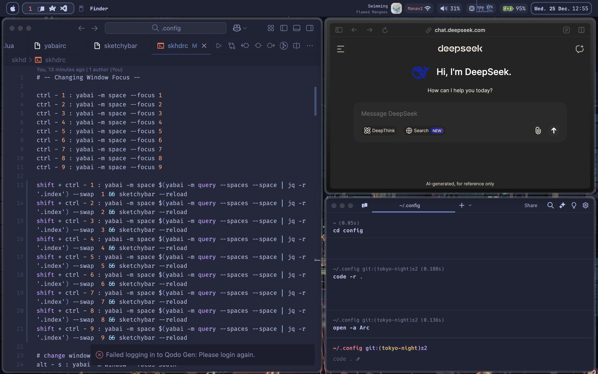

# My MacOS Setup ⚡️

<p align="center">
<a href="./assets/Desktop.jpg">
  
</a>
</p>

_My workflow setup with yabai window manager_

<p align="center">
<a href="./assets/Workflow.jpg">
  
</a>
</p>

_Current workflow featuring my daily applications and window management_

<p align="center">
<a href="./assets/MenuBar.jpg">
  
</a>
</p>

_Custom sketchybar configuration_

## ✨ Details

A minimal and productive MacOS setup focused on keyboard-driven workflow.

### System

- **OS**: MacOS
- **Window Manager**: [yabai](https://github.com/koekeishiya/yabai)
- **Hotkey Daemon**: [skhd](https://github.com/koekeishiya/skhd)
- **Status Bar**: [sketchybar](https://github.com/FelixKratz/SketchyBar)
- **Window Borders**: [JankyBorders](https://github.com/FelixKratz/JankyBorders)

### Applications

- **Terminal**: [Warp](https://www.warp.dev) with [zoxide](https://github.com/ajeetdsouza/zoxide)
- **Editor**: Visual Studio Code
- **Browser**: [Arc](https://arc.net)
- **Launcher**: [Raycast](https://www.raycast.com)

### Themes & Icons

- **Bar Icons**: [sketchybar-app-font](https://github.com/kvndrsslr/sketchybar-app-font) - Custom icon font for system monitoring and application indicators

## 📝 Configuration

### Window Management (yabai)

```bash
# Example yabai configuration
yabai -m config layout bsp
yabai -m config window_gap 10
```

### Keyboard Shortcuts (skhd)

```bash
# Example skhd configuration
alt - j : yabai -m window --focus south
alt - k : yabai -m window --focus north
```

### Status Bar (sketchybar)

```bash
# Example sketchybar configuration
sketchybar --add item clock right
sketchybar --set clock update_freq=10

# Load custom font
FONT="SF Pro" # Primary font
NERD_FONT="sketchybar-app-font:Regular:16.0" # Custom icon font

sketchybar --bar \
    height=32 \
    blur_radius=30 \
    position=top \
    padding_left=10 \
    padding_right=10 \
    color=0x15ffffff \
    font_family=$FONT \
    icon_font_family=$NERD_FONT
```

## ⚙️ Customization

You can customize this setup by modifying the config files:

- `~/.config/yabai/yabairc`
- `~/.config/skhd/skhdrc`
- `~/.config/sketchybar/sketchybarrc`